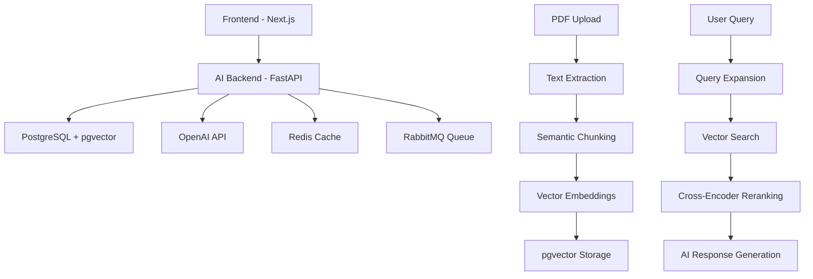

# Building RAG is Not a Problem

An **open-source system** that helps developers quickly set up and run a **RAG (Retrieval-Augmented Generation) pipeline** with ready-made APIs.

## 🎯 What is this?

This platform provides a complete, production-ready RAG system that you can deploy and use immediately. It's designed to help developers understand and implement RAG without the complexity of building everything from scratch.

## ✨ Features

- **PDF Processing**: Upload and chunk PDFs with intelligent semantic analysis
- **Vector Search**: Fast similarity search using pgvector and PostgreSQL
- **AI Chat**: RAG-powered conversations with your documents
- **Ready APIs**: RESTful endpoints for all RAG operations
- **Modern UI**: Clean, responsive frontend built with Next.js
- **Production Ready**: Docker support, logging, analytics, and monitoring

## 🏗️ Architecture



## 🚀 Live Demo

**Deployed at**: https://building-rag-54-197-183-32.sslip.io/

## 🛠️ Tech Stack

- **Frontend**: Next.js 14, TypeScript, Tailwind CSS
- **Backend**: FastAPI, Python 3.11+, SQLAlchemy
- **Database**: PostgreSQL with pgvector extension
- **Vector Search**: OpenAI embeddings + cross-encoder reranking
- **Infrastructure**: Docker, Redis, RabbitMQ

## 📚 Quick Start

1. **Clone the repository**
   ```bash
   git clone <your-repo-url>
   cd buildingragisnotaproblem
   ```

2. **Set up environment variables**
   ```bash
   cp ai-backend/.env.example ai-backend/.env
   cp frontend/.env.example frontend/.env
   # Edit with your OpenAI API key and database credentials
   ```

3. **Run with Docker**
   ```bash
   docker compose up -d
   ```

4. **Access the application**
   - Frontend: http://localhost:3000
   - Backend API: http://localhost:8000
   - API Docs: http://localhost:8000/docs

## 🤝 Contributing

This is an **open-source project** created to help the developer community. Contributions are welcome!

- Report bugs
- Suggest features
- Submit pull requests
- Improve documentation

## 📄 License

MIT License - feel free to use this in your own projects.

## 💡 Why Open Source?

This project exists to:
- **Educate** developers about RAG implementation
- **Accelerate** RAG adoption in the community
- **Provide** a solid foundation for building RAG applications
- **Demonstrate** best practices for production RAG systems

---

**Not a paid product** - just a developer tool created to make RAG accessible to everyone.
